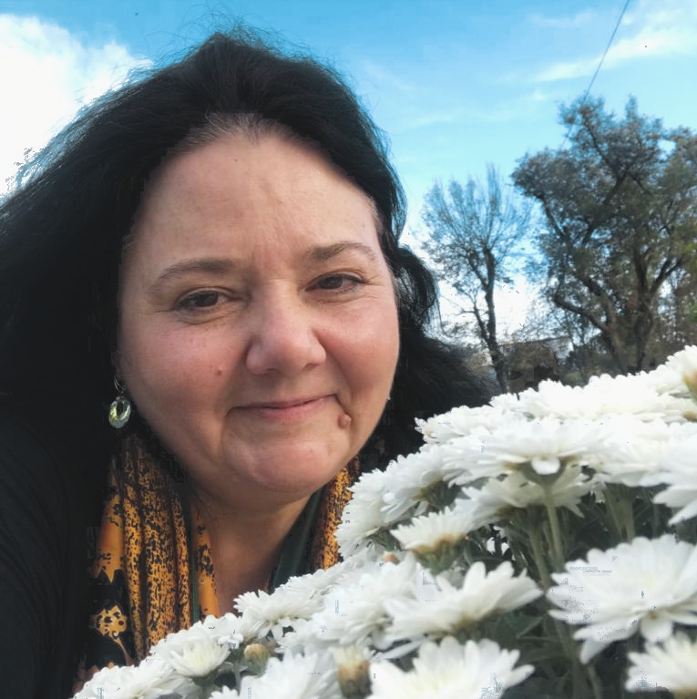

  

    

      
&nbsp;

      <h2 class="text-center-xs text-center-sm">Abordarea psihoterapeutică</h2>

      

      Lucrez de mai bine de 17 ani ca psihoterapeut iar ceea ce am constatat de-a lungul experienței mele este că fiecare adult sau copil are nevoie sa fie văzut și ascultat, să se simtă semnificativ. Atunci când cineva e văzut pentru ceea ce este el sau ea,  dincolo de povestea de suprafață, transformarea se întâmplă și arată … miraculos.
      

      

      Cred tot mai mult în  capacitatea psihicului uman de a se reorganiza,  de a se vindeca pe sine. Așa suntem creați.
      Dar această capacitate de autovindecare  și restructurare se activează  în condițiile potrivite, după cum ne spune  C.G. Jung. De aceea, întotdeauna vei găsi aici un cadru în care este respectată individualitatea persoanei, un <i>spațiu liber și protejat</i> (Dora Kalff).
      

      

      Psihoterapia e domeniul de transformare psihică, de restructurare, vindecare  și individuație însă uneori avem nevoie să numim ceea ce reprezintă suferința și îi spunem depresie, anxietate, tulburare de personalitate, confuzie, somatizare, ticuri nervoase, disfuncții sexuale și multe altele. Putem face o evaluare pentru a ne ajuta să înțelegem ce ai nevoie, să înțelegi prin ce treci.
      

      
&nbsp;

    

    

      
&nbsp;

      
&nbsp;

      

      <h3 class="text-center blue">Leni Burlacu</h3>
      <h4 class="text-center highlight orange">Psiholog DRD, Psihoterapeut</h4>
    

  

  

    <h1 class="text-center">Psihoterapia copiilor</h1>

    

    

    În psihoterapia copiilor, abordarea este prin joc, acesta fiind limbajul lor de dezvoltare psihică.
    

    

    Mă voi întâlni întâi cu adulții care îl îngrijesc pe copil,  într-o ședință destinată părinților și în care am ca obiective:  să înțeleg cu ce se confruntă părintele, cum vede el situația, din ce punct are nevoie de ajutor și care sunt așteptările de la terapie. Discutăm despre tot ce are nevoie să știe despre metodele de lucru, despre cum ne vom reîntâlni în ședințe destinate părinților  și despre cum îi va spune copilului prima dată că va veni la psihoterapie.
    

    

    În terapia copilului am lucrat cu rezultate semnificative  pe următoarele problematici:  depresie, anxietate, ADHD, tulburări de învățare, ticuri nervoase, tulburări din spectrul autist (teoria minții și lucrul în sandplay therapy).
    

    
&nbsp;

  

  

    

      <h1>Metode practicate</h1>

      

      Formările mele principale în psihoterapie sunt în <a href="hipnoza.html">Hipnoza Ericksoniana</a>, psihotraumatologie si <a href="sandplay.html">Sandplay Therapy</a>.
      

      

      Aici este un <a href="https://ast.wildapricot.org/Sys/PublicProfile/59247838/6018618" target="_blank">link</a> către pagina Asociației de Sandplay Therapy din SUA unde sunt înregistrată ca sandplay therapist.
      

      

      Pentru a vedea mai multe detalii despre pregatirea si acreditarile mele, vezi CV-ul meu <a href="/assets/files/CV-Leni-Burlacu-2023.pdf" target="_blank">aici</a>.
      

      
&nbsp;

    

  

